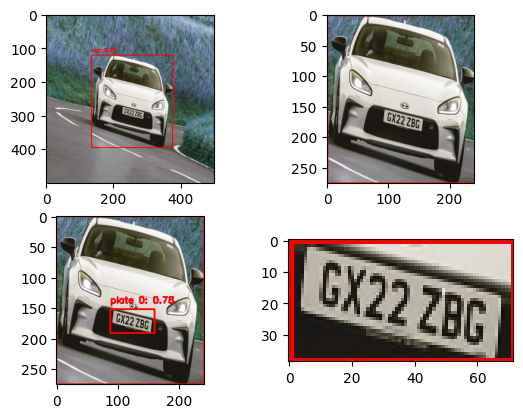
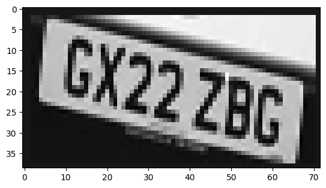
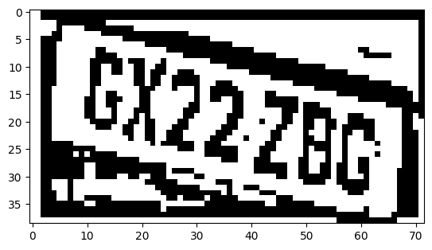
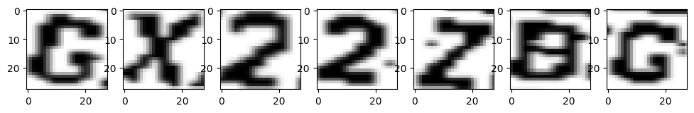

## 🚗 Car Detection & License Plate Extraction (OpenCV + Python)

A complete computer vision project that detects moving vehicles in a video stream and extracts their license plates. Built with OpenCV and background subtraction techniques.

---

### 📸 Overview

This project uses traditional image processing methods to:

* Detect and track moving vehicles using background subtraction.
* Extract vehicules from images.
* Extract license plate areas for further processing.
* Use OCR to detect plate text

---

### ✨ Features

* ✅ Vehicle detection with contour filtering
* ✅ Line-crossing-based vehicle counting
* ✅ License plate region extraction using bounding boxes
* ✅ Preprocessing for plate clarity
* 🧩 Easily extendable for OCR (e.g., Tesseract or CRNN)

---

### 🗂 Project Structure

```
📁 CarDetection-PlateExtraction/
│
├── CarsDetection and plate extraction(1).ipynb  # Main notebook
├── images/
│   ├── original.png                             # [placeholder]
│   └── plate_example.png                        # [placeholder]
│   └── plate_segmented.png                      # [placeholder]
│   └── plate_content_divided.png                # [placeholder]
└── README.md
```

---

### 📦 Requirements

Install dependencies using pip:

```bash
pip install opencv-python opencv-contrib-python numpy
```

---

### ▶️ How to Run

1. Launch the notebook:

```bash
jupyter notebook "CarsDetection and plate extraction(1).ipynb"
```

2. Ensure `video.mp4` is present in the same directory.
3. Run all cells to begin processing.

---

### 🔍 Pipeline Summary

1. **Read Video:** Load frame-by-frame.
2. **Grayscale & Blur:** Preprocessing to reduce noise.
3. **Background Subtraction:** Isolate moving objects.
4. **Morphological Filtering:** Improve segmentation quality.
5. **Contour Detection:** Find potential vehicles.
6. **Vehicle Counting:** Count each car that crosses a defined line.
7. **License Plate Detection:** Extract ROIs from detected vehicle areas.

---

### 🧪 Sample Results

| Input Frame & plate detection |
| ----------------------------- |
|  |
| Plate extraction & segmentation |
|  | 
| ----------------------------- |
|  |
| ----------------------------- |
|  |


